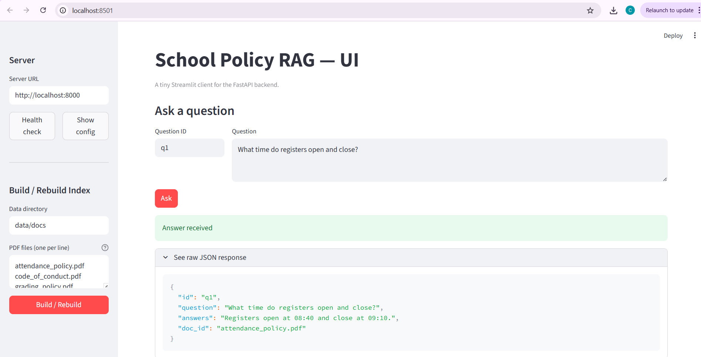

# Task A : Design Thinking (Docs & UI)

Here’s the design thinking write-up and a small UI prototype for the modern School Management System.

**Task A (PDF):** [TaskA_Design_Solution](static/Task_A_design_solution.pdf)  

 
**HTML UI prototype:** [taskA_ui_prototype](static/index.html)  

  A static, click-through mockup showing Teacher, Student, Parent, and Admin views.  
  Open it in your browser (no backend needed). Great for demos and quick feedback.


# School Policy RAG : Task B

A small retrieval‑augmented QA system that answers questions about three school policy PDFs:

- **Attendance policy**
- **Code of conduct**
- **Grading policy**

You can use it in three ways:
1) From the **command line** (quick tests)  
2) As a **REST API** (FastAPI)  
3) With a tiny **browser UI** (Streamlit)

---

## What’s in this folder

- `school_policy_rag.py` – the RAG engine (PDF parsing, chunking, embeddings with SentenceTransformers, FAISS search, concise answer extraction). Also includes a tiny **LFU cache** (up to 10 repeated questions).
- `server.py` – FastAPI app exposing `/health`, `/build`, `/ask` (and `/config` for convenience).
- `app.py` – Streamlit UI that talks to the API.
- `data/docs/` – put your PDFs here (defaults below).

> Default filenames expected by the code:  
> `attendance_policy.pdf`, `code_of_conduct.pdf`, `grading_policy.pdf`  
> You can change them when you build the index.

---

## Prerequisites

- **Python 3.10–3.12** (recommended)
- Internet on the **first** run only (to download the embedding model)
- Install dependencies in a virtual environment:

```bash
# from the project root
python -m venv .venv
# Windows: .\.venv\Scripts\activate
# macOS/Linux:
source .venv/bin/activate

pip install --upgrade pip
pip install -r requirements.txt
```

Put your PDFs here (create folders if needed):

```
data/docs/attendance_policy.pdf
data/docs/code_of_conduct.pdf
data/docs/grading_policy.pdf
```

---

## Option A — Command line (quickest)

Ask one question:

```bash
python school_policy_rag.py --data_dir data/docs --ask "After how many unauthorised sessions may a penalty notice be considered?"
```

Interactive loop:

```bash
python school_policy_rag.py --data_dir data/docs --loop
```

Useful flags:

- `--files` list of PDF filenames to index


> **Cache note:** repeated questions are served from an in‑memory LFU cache (size 10). It resets when the process restarts.

---

## Option B — REST API (FastAPI)

Start the API:

```bash
uvicorn server:app --host 0.0.0.0 --port 8000
```

**Health**

```bash
curl -s http://localhost:8000/health
```

**Build** (choose data dir and files)

```bash
curl -s -X POST http://localhost:8000/build   -H "Content-Type: application/json"   -d '{"data_dir":"data/docs","files":["attendance_policy.pdf","code_of_conduct.pdf","grading_policy.pdf"]}'
```

**Ask**

```bash
curl -s -X POST http://localhost:8000/ask   -H "Content-Type: application/json"   -d '{"id":"q1","question":"What time do registers open and close?"}'
```

Example response:

```json
{
  "id": "q1",
  "question": "What time do registers open and close?",
  "answers": "Registers open at 08:40 and close at 09:10.",
  "doc_id": "attendance_policy.pdf"
}
```

> If you skip `/build`, the server tries a **lazy build** using defaults *if* `data/docs/` exists.  
> Optional endpoint: `GET /config` returns the current data dir, files, and whether the index is ready.

---

## Option C — Streamlit UI (browser)

Run in a second terminal:

```bash
streamlit run app.py --server.port 8501 --server.address 0.0.0.0
```

In the UI sidebar:

1. Set **Server URL** (defaults to `http://localhost:8000`)
2. Click **Health check**
3. Click **Build / Rebuild** (uses the default PDFs unless you edit the list)
4. Ask questions or upload a **JSONL** file for batch Q&A

---


## UI Preview




## Batch (optional)

Create `policy_questions.jsonl` (one JSON per line):

```json
{"id":"q1","question":"After how many unauthorised sessions may a penalty notice be considered?"}
{"id":"q2","question":"What time do registers open and close?"}
{"id":"q3","question":"What four KS3 bands are used for reporting?"}
```

Minimal evaluator script:

```python
# eval_jsonl.py
import json
from school_policy_rag import build_index, answer_question

idx = build_index("data/docs", [
    "attendance_policy.pdf",
    "code_of_conduct.pdf",
    "grading_policy.pdf"
])
with open("policy_questions.jsonl", "r", encoding="utf-8") as f:
    for ln in f:
        if not ln.strip():
            continue
        q = json.loads(ln)
        res = answer_question(idx, q["question"], q_id=q.get("id","q"))
        print(json.dumps(res, ensure_ascii=False))
```

Run:

```bash
python eval_jsonl.py > results.jsonl
```

---

## How it works 

The engine parses your PDFs with PyMuPDF, cleans odd Unicode, and splits the text into section‑aware, sentence‑aware chunks (~1,000 chars, with overlap). It creates MiniLM embeddings (`all‑MiniLM‑L6‑v2`), builds a FAISS index (cosine on L2‑normalised vectors), retrieves top‑k chunks for a question (with small doc‑type priors), and extracts concise answers. Guardrails prefer sentences that contain **numbers** (e.g., “10 sessions”), **times** (e.g., “08:40”, “first day”), or **finance terms** for fee‑like questions; it also recognises **KS3 bands** and can stitch **register open/close** times across adjacent sentences. A tiny 10‑entry LFU cache serves repeated questions instantly.

---

## Troubleshooting

- **FAISS install fails** → Update pip and retry:
  ```bash
  pip install --upgrade pip
  pip install faiss-cpu
  ```

---

